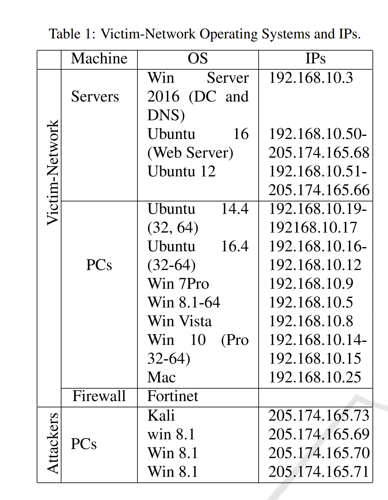

字段：

攻击流量与正常流量的熵差异越大，该特征对区分攻击流量和正常流量的效果就越有效

选择源IP地址、数据包长度和协议（根据https://ieeexplore.ieee.org/abstract/document/9085007?casa_token=0QT9-2r8mHUAAAAA:1P80rTGvl3nXLUvA8LR9LE2V6YAXXQciE0UDxcxnTw87Sx2VhZQBOm8YrrjjhT8TwAext9KZV7X8Uw）

https://ieeexplore.ieee.org/abstract/document/9678955?casa_token=WzbhYjmU_KMAAAAA:O3mx1A4C_Lzm-CTMOrXeg70URKPb-_BkRSmiCANPHAHgy41-4nrttiF_BC8YsUqfKngkYj5ll1Xg#full-text-header

根据香农公式计算熵值后在线更新，利用**霍夫丁不等式更新阈值**

* 切比雪夫不等式是一种通用的不等式，适用于任何随机变量，但提供的上界可能相对宽松。
* 霍夫丁不等式在特定条件下（独立同分布、大样本）提供了更紧凑的概率上界，通常对于大样本情况更为精确。

时差

实际时间 11 pcap  8  csv

9.47            20.47     12.47

使用qleaning调整阈值，近似数计算 1/8

